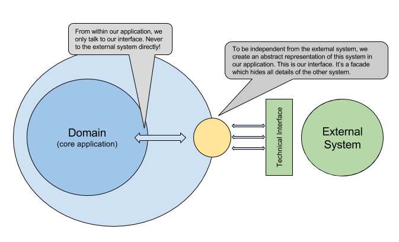
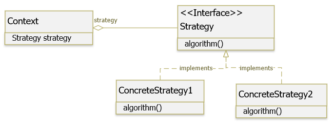
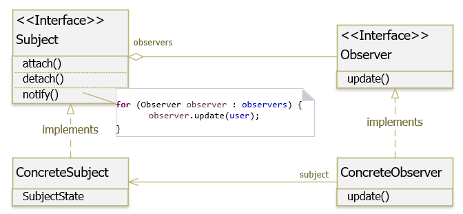
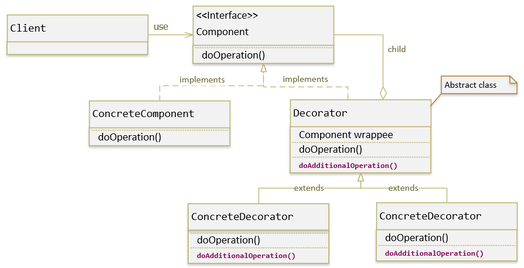
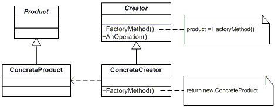
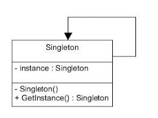
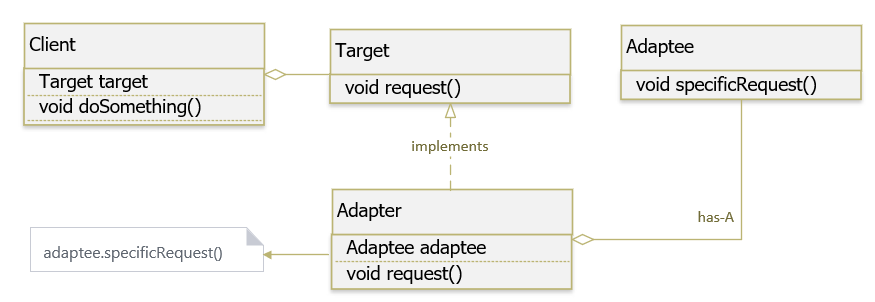
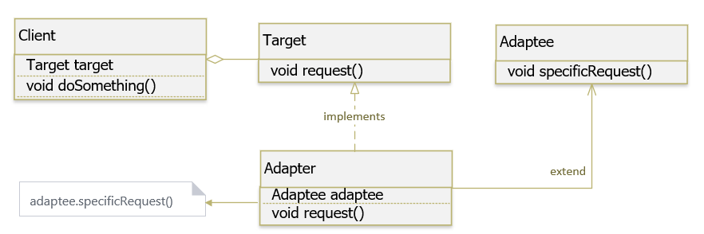
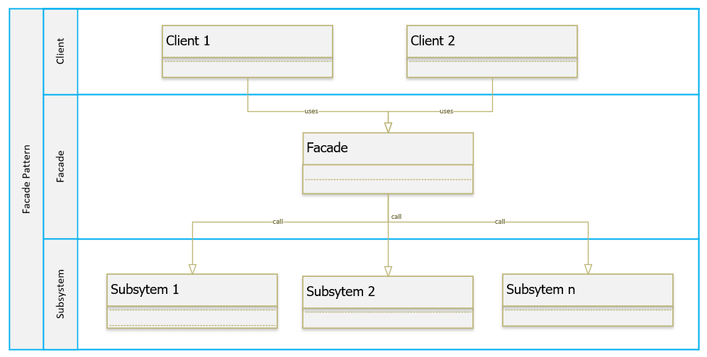

# Design Pattern

#### Design Principle

- Identify the aspects of your application the vary and separate them from what stays the same ( **Take the parts that vary and encapsulate them, so that later you can alter or extend the parts that vary without affecting those that don't** )

- Program to an interface, not an implementation ( The design principle *interface* **refers to lose coupling between modules or systems**. Whenever you build a larger piece of software, you will have dependencies to other systems. For example to a relational database or to a REST service. All of those dependencies represent tools for your software to fulfil its goals. Such a goal might be to manage contacts in an address bock app or to process orders in an online shop. But whatever the goal of your software is, your goal as a software developer should be to model your problem domain nice and clean )

  

- Favor composition over inheritance. ( Creating systems using composition gives you a lot more flexibility. Not only does it let you encapsulate a family of algorithms into their own set of classes, but it also lets you **change behavior at runtime** as long as the object you're composing with implements the correct behavior interface )

- Strive for loosely coupled designs between objects that interact ( **Loosely coupled designs allow us to build flexible OO systems that can handle change because they minimize the interdependency between objects** )

- Classes should be open for extension, but closed for modification.

- Depend upon abstractions. Do not depend upon concrete classes

## Strategy Pattern

###### " Define a family of algorithms, encapsulate each one, and make them interchangeable. Strategy lets the algorithm vary independently from the clients that use it "

## Observer Pattern

###### " Define a one-to-many dependency between objects so that when one object changes state, all its dependents are notified and updated automatically "

## Decorator Pattern

###### " Attach additional responsibilities to an object dynamically. Decorators provide a flexible alternative to subclassing for extending functionality "

## Factory Method Pattern

###### " Factory Method is a creational design pattern that Define an interface for creating an object, but let subclasses decide which class to instantiate. Factory Method lets a class defer instantiation to subclasses "

## Abstract Factory Pattern

###### " The Abstract Factory Pattern provides an interface for creating families of related or dependent objects without specifying their concrete classes "

## Singleton Pattern

###### "  The Singleton Pattern ensures a class has only one instance, and provides a global point of access to it "

## Adapter Pattern

###### "  The Adapter Pattern converts the interface of a class into another interface the clients expect. Adapter lets classes work together that coundn't otherwise because of incompatible interface "

_Object Adapter - Composition_

_Class Adapter - Inheritance_

## Facade Pattern

###### "  The Facade Pattern provides a unified interface to a set of interface in a subsystem. Facade defines a highter-level interface that makes the subsystem easier to use. "

